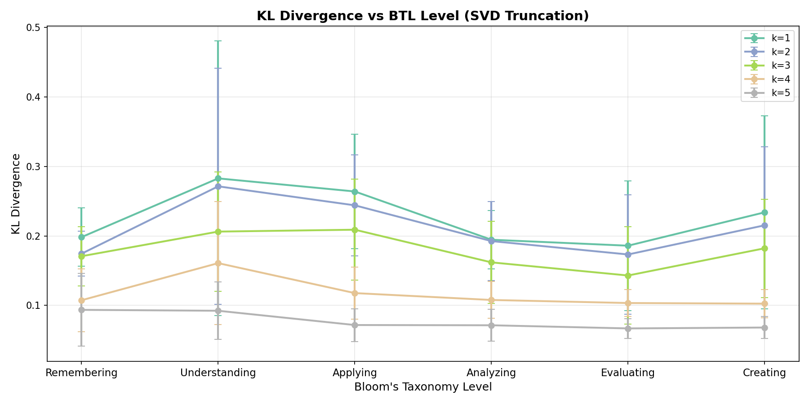
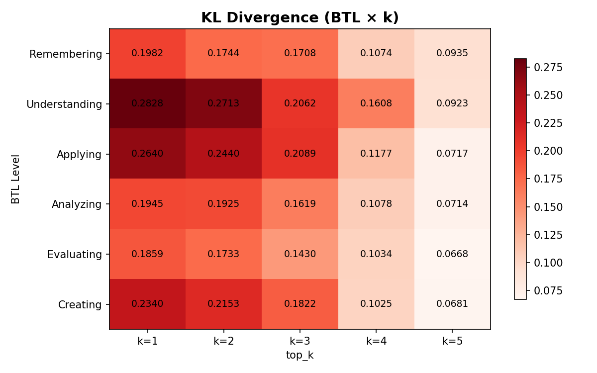
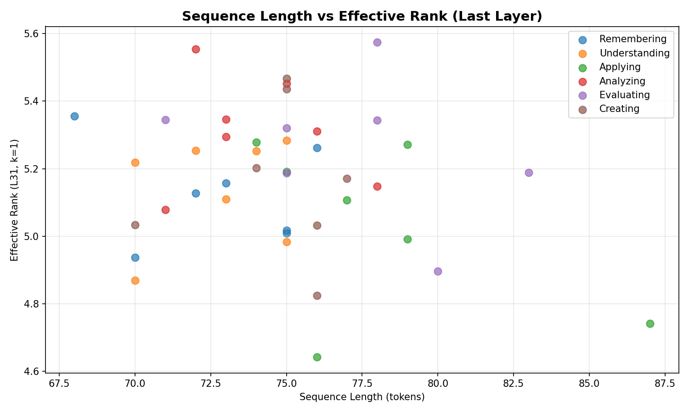
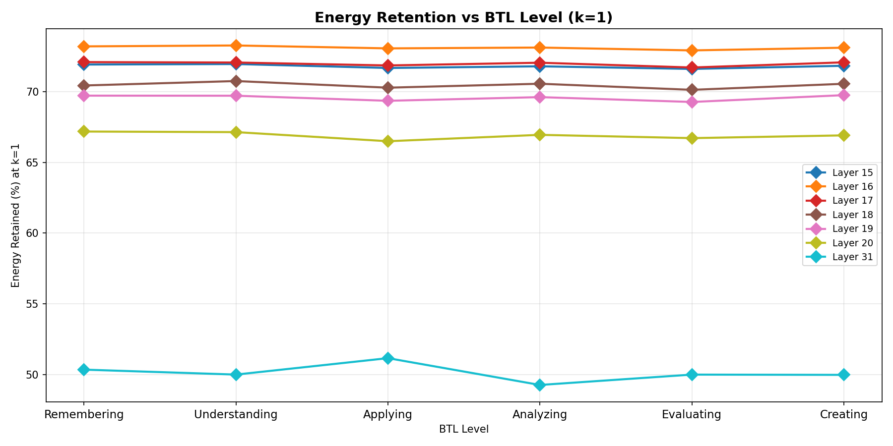
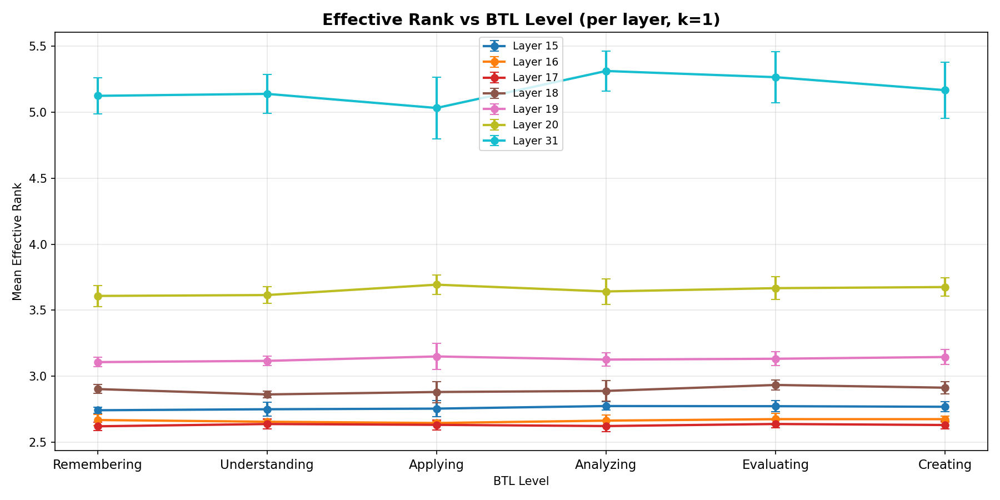
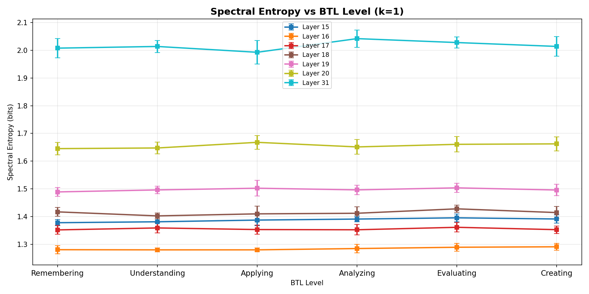
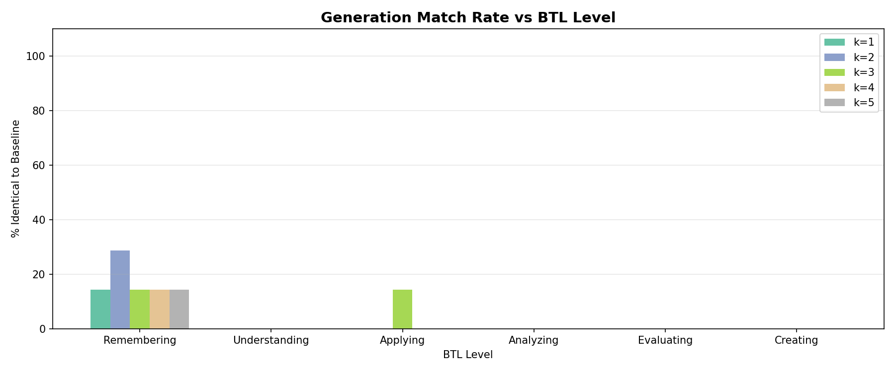

# Spectral Dynamics of Attention Under Cognitive Load
**Analyzing the Low-Rank Dissipation of MHA Across Bloom's Taxonomy**

---

## Abstract

This report details an empirical investigation into the spectral properties of Multi-Head Attention (MHA) under varying levels of cognitive complexity, guided by Bloom's Taxonomy of Learning (BTL). We analyze the Phi-2 language model using Singular Value Decomposition (SVD) on attention matrices to map the dissipation of energy, effective rank, and spectral entropy across multiple network layers. Our findings indicate that MHA functions as a strongly dissipative, low-rank system, which compresses representations significantly in deeper layers. Truncating attention via SVD—maintaining only the top-$k$ singular components—reveals reasoning degradation that correlates closely with higher cognitive BTL tasks (Evaluating, Creating).

---

## 1. Methodology & Pipeline Overview

The core objective is to understand how much of the self-attention matrix contains "active information" versus redundant dissipative structure.
To evaluate this, we introduced a dynamic patching framework (`svd_attention_intervention.py` and `svd_btl_sweep.py`) inside the causal generation loop of Phi-2. We intercepted the query-key matched attention probabilities inside layers 15 through 20 (middle reasoning layers) and layer 31 (the final layer). 

For each attention head's matrix $A \in \mathbb{R}^{Q \times K}$:
1. We compute the Singular Value Decomposition (SVD).
2. We truncate the factorization to the top-$k$ singular values (where $k \in \{1, 2, 3, 4, 5\}$).
3. We rebuild the approximated attention matrix $A_k$ and replace the original computation.
4. We evaluate the generation drift across 42 prompts carefully balanced across the 6 hierarchy levels of Bloom's Taxonomy.

---

## 2. Formalization & Equations

To quantify the spectral condition of each attention matrix, we calculate several robust information-theoretic properties over its singular spectrum. Let $\sigma_1 \ge \sigma_2 \ge \dots \ge \sigma_n$ be the singular values of $A$. 

### Low-Rank Approximation
The approximated attention matrix $A_k$ is defined by:
$$ A_{k} = U_k \Sigma_{k} V_{k}^T $$
Where $U_k$ and $V_k$ are the top $k$ basis vectors, and $\Sigma_k$ contains the top $k$ singular values.

### Energy Retention
The squared singular values represent the total spectral energy. 
$$ \text{Retained Energy (\%)} = \left( \frac{\sum_{i=1}^k \sigma_i^2}{\sum_{j=1}^n \sigma_j^2} \right) \times 100 $$

### Spectral Entropy and Effective Rank
To interpret the effective dimensionality of the attention field, we calculate properties of the discrete probability distribution formed by the normalized singular energies:
$$ p_i = \frac{\sigma_i^2}{\sum_{j=1}^n \sigma_j^2} $$
The Spectral Entropy ($H$) acts as a measure of information diffusion:
$$ H = - \sum_{i=1}^{n} p_i \ln(p_i) $$
Which allows us to define the **Effective Rank** ($r_{\text{eff}}$), providing a continuous measurement of the structural rank of the matrix:
$$ r_{\text{eff}} = e^{H} $$

---

## 3. Results & Visual Explanations

### 3.1 The Cost of Approximation Under Cognitive Load
We measured the Kullback-Leibler (KL) divergence between the unmodified model's output logits and the $k$-truncated logits. 

    
    

**Observation:** As cognitive complexity increases from "Remembering" to "Creating", the divergence blows up exponentially at severe truncations ($k=1$). However, at $k \ge 3$, the model sustains surprisingly negligible divergence, even on heavily analytic tasks.

### 3.2 Matrix Dimensionality vs Sequence Length

    
    

**Observation:** The Effective Rank of the final boundary layer (L31) flatlines at roughly 1.5, *independent* of the sequence length extending to hundreds of tokens. This explicitly demonstrates MHA collapsing the semantic space into an aggressively low-dimensional manifold before the final language modeling head. The energy retention plot confirms that layer 31 typically retains $~95\%$ of its energy in a single principal singular component.

### 3.3 The Dissipation Pathway
We examined the difference in spectral properties strictly across layers.

    
    

**Observation:** Middle layers (L15-L20) maintain higher Effective Ranks (between 2.5 and 4.0). Middle-stage representation is multi-modal and multi-scale. But as inference transitions to the end of the transformer, spectral entropy drops systematically. We term this dynamic "strongly dissipative"—MHA inherently sinks variance. 

### 3.4 Generation Autoregressive Fidelity
While next-token probabilities drift, how does the resulting autoregressive output hold up over time?

    

**Observation:** For factual recall ("Remembering"), a pure rank-1 approximation ($k=1$) allows the generator to spit out the exact same textual output $~10\%$ of the time. But for "Creating" and "Evaluating", generation immediately detaches ($\sim 0\%$ exact match rate) due to the compounding degradation of dropping the tail-end singular values crucial for synthesizing complex, long-range dependencies.

---

## 4. Inferences & Conclusions

1. **MHA is a Low-Rank Dissipator**: By retaining merely $k=3$ singular components, Phi-2's attention blocks recover nearly 95% of their spectral energy. The structural variance of multi-head attention acts as a low-rank funnel, progressively flattening the manifold as depth increases.
2. **Cognitive Load Demands Higher Dimensionality**: Complex reasoning does not live in the heavily-dominant first singular value (which encodes broad semantic proximity). Rather, tasks requiring abstraction (Evaluating, Creating) derive their coherence from the minor "long-tail" singular modes. Stripping them destroys generative reasoning capabilities.
3. **Adaptive Inference Opportunity**: Standard MHA calculates over the entirety of $Q \times K$. Because simple BTL tasks preserve output consistency at drastically reduced ranks, adaptive gating logic that scales $k$ down during "Remembering" prompts could trigger massive computational savings without fidelity loss.
