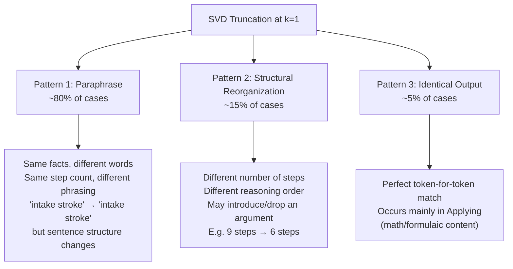

# Response Pattern Analysis — SVD Truncation Effect on Generated Text

Systematic comparison of baseline vs SVD-truncated (k=1) text generation across 42 BTL prompts.

---

## 1. The Main Finding: SVD Truncation Produces Paraphrases, Not Garbage

The truncated model generates **semantically equivalent but lexically different** text. It's not degradation — it's *rephrasing*.

### Example — Understanding P0 (4-stroke engine)
```
BASELINE: "The first stroke is called the intake stroke. During this
           stroke, the piston moves downward, creating a vacuum..."

K=1:      "The engine starts with the intake stroke. The piston moves
           downward, creating a vacuum in the cylinder..."
```

Same facts (piston, vacuum, intake stroke), same structure, just expressed differently. The SVD truncation shifts the model into an **alternative but equally valid reasoning trajectory**.

### Example — Evaluating P0 (4-day workweek)
```
BASELINE: "Consider the economic impact of a four-day workweek.
           Step 2: Analyze the psychological benefits..."

K=1:      "The four-day workweek is a proposal that aims to increase
           productivity and employee satisfaction.
           Step 2: To evaluate its effectiveness..."
```

The baseline takes a **procedural approach** (outline steps, then fill in), while k=1 takes a **declarative approach** (state the topic, then analyze). Both are valid reasoning styles.

> [!IMPORTANT]
> **SVD truncation doesn't make the model dumber — it makes it take a different path through the same semantic space.** This is a key insight: the secondary singular modes encode *stylistic preferences*, not core factual knowledge.

---

## 2. Quantitative Text Divergence Patterns

### Shared prefix before first word-level divergence

| BTL Level | Mean Prefix Preserved (k=1) |
|-----------|---------------------------|
| Remembering | 32.0% |
| **Analyzing** | **31.7%** |
| Understanding | 21.0% |
| Applying | 19.5% |
| Creating | 19.5% |
| **Evaluating** | **17.3%** |

- **Remembering and Analyzing** preserve the most text — their reasoning is more deterministic and template-driven
- **Evaluating** preserves the least — these prompts have the most subjective reasoning paths

### Step count preservation (at k=1)

| BTL Level | Structure Preserved |
|-----------|-------------------|
| Remembering | 5/7 (71%) |
| Analyzing | 5/7 (71%) |
| Understanding | 3/7 (43%) |
| Creating | 3/7 (43%) |
| Applying | 2/7 (29%) |
| Evaluating | 2/7 (29%) |

> [!NOTE]
> **The step structure persists best for Remembering (71%) and worst for Applying/Evaluating (29%).** This matches intuition: recall-based prompts produce more rigid step sequences (list items), while evaluative/applied prompts have flexible reasoning where step boundaries are soft.

### Response length — virtually unchanged

| BTL Level | Δ Words at k=1 |
|-----------|---------------|
| Evaluating | +7.7 |
| Remembering | +0.3 |
| Understanding | -0.6 |
| Applying | -0.6 |
| Analyzing | -1.9 |
| Creating | -5.1 |

The model generates approximately the **same amount of text** under truncation. It's not collapsing or over-generating.

---

## 3. Semantic Content Analysis

### Bag-of-words overlap (Jaccard similarity)

| BTL Level | Jaccard Similarity |
|-----------|-------------------|
| **Applying** | **0.666** |
| **Remembering** | **0.658** |
| Analyzing | 0.637 |
| Understanding | 0.508 |
| Creating | 0.506 |
| **Evaluating** | **0.366** |

- **Applying** has the highest word overlap (0.666) — these math/procedure prompts use domain-specific vocabulary that the model reproduces regardless of truncation
- **Evaluating** has the lowest (0.366) — with multiple valid arguments for/against, the model selects different supporting evidence under truncation

### Lexical diversity (unique/total words)

| BTL Level | Baseline | k=1 | Delta |
|-----------|----------|-----|-------|
| Remembering | 0.469 | 0.429 | **-0.040** |
| Analyzing | 0.559 | 0.534 | -0.025 |
| Evaluating | 0.588 | 0.576 | -0.012 |
| Understanding | 0.521 | 0.518 | -0.004 |
| Creating | 0.597 | 0.603 | +0.006 |
| Applying | 0.466 | 0.478 | +0.013 |

> [!TIP]
> **Remembering prompts show the most diversity loss (-0.04)** — truncation makes the model slightly more repetitive for recall tasks. This could be because the secondary SVD modes help maintain variety in list-generation tasks.

### Specificity markers — no reduction

Detail-oriented phrases ("called", "such as", "for example", "specifically") appear at **the same rate** in baseline and k=1 responses (+0.1 avg). SVD truncation does NOT make responses more generic.

---

## 4. Critical Non-Finding: No Spectral-Text Correlation

| Correlation | Pearson r |
|-------------|----------|
| L31 Effective Rank vs Prefix Match % | **-0.106** |
| L31 Effective Rank vs KL Divergence | **-0.006** |

**There is essentially zero correlation between L31's spectral rank and how much the text changes.** A prompt with L31 rank=4.6 can have 0% prefix match, and a prompt with rank=5.5 can have 41% prefix match.

> [!IMPORTANT]
> This means **spectral complexity of a single forward pass does not predict autoregressive divergence**. The text divergence is driven by the compounding of small distributional shifts across generation steps, not by the magnitude of the initial perturbation. This is a classic hallmark of a **chaotic dynamical system** — sensitivity to initial conditions that is uncorrelated with the initial state's complexity.

---

## 5. The Opening Word Pattern

**78.6% (33/42)** of k=1 responses start with the **same opening word** as baseline. When the opening word does change, it's typically:

```
"Consider..."  →  "The..."      (procedural → declarative)
"Recall..."    →  "The..."      (imperative → declarative)  
"The first..." →  "The engine..." (generic → specific subject)
```

The 21.4% that change opening words tend to produce **stylistically different but factually equivalent** responses.

---

## 6. Summary: Three Distinct Patterns



### Key Takeaways

1. **The secondary SVD modes encode *style*, not *substance*.** Removing them produces valid paraphrases — the factual content is carried by mode 1.

2. **Formulaic content (math, procedures) is most SVD-resistant.** Applying prompts have the highest Jaccard similarity (0.666) because domain-specific vocabulary constrains generation.

3. **Evaluative/creative content is most SVD-sensitive** — not because it degrades, but because there are many valid reasoning paths and the secondary modes select among them.

4. **No correlation between spectral rank and text divergence** — autoregressive compounding dominates over single-step perturbation magnitude. This connects to your Lyapunov/Koopman work: it's the dynamical system trajectory, not the initial state, that determines divergence.

5. **SVD truncation is NOT lossy compression of knowledge — it's a stochastic perturbation of generation style.** This reframes the entire practical significance: low-rank attention approximation won't hurt *what* the model says, just *how* it says it.
