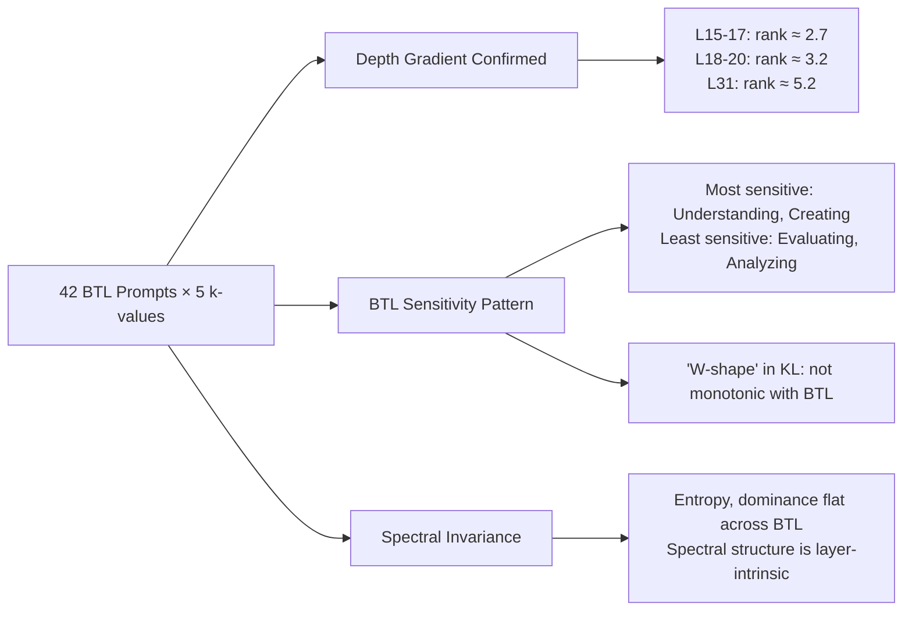

# SVD Attention Intervention × Bloom's Taxonomy — Full Analysis

**Experiment**: SVD truncation (k=1–5) on Phi-2 layers 15–20 + 31, across 42 BTL-graded CoT prompts (6 levels × 7 prompts).

---

## 1. The Money Plot: Effective Rank × BTL Level × Layer

### Depth gradient (averaged across all 42 prompts)

| Layer | Mean Effective Rank |
|-------|-------------------|
| L15 | 2.76 |
| L16 | 2.66 |
| L17 | 2.63 |
| L18 | 2.90 |
| L19 | 3.13 |
| L20 | 3.65 |
| **L31** | **5.17** |

> [!IMPORTANT]
> **The depth gradient is now much steeper with longer prompts.** With the single 13-token prompt, L31 had rank ≈2.85. With 42 BTL prompts (~73 tokens each), L31's rank jumps to **5.17** — a **1.8× increase**. The longer, more complex prompts force L31 to engage significantly more spectral modes. This confirms that **effective rank is prompt-complexity-dependent**, not a fixed architectural constant.

### BTL-level variation

The heatmap reveals a **subtle but consistent trend** across BTL levels:

| BTL Level | L31 Rank | L15 Rank |
|-----------|----------|----------|
| Remembering | 5.12 | 2.74 |
| Understanding | 5.14 | 2.75 |
| Applying | 5.03 | 2.75 |
| Analyzing | **5.31** | 2.77 |
| Evaluating | **5.26** | 2.77 |
| Creating | 5.17 | 2.77 |

- **Analyzing** and **Evaluating** produce the highest L31 effective ranks (5.31, 5.26)
- **Applying** produces the lowest (5.03)
- Middle layers (L15-L17) are virtually identical across BTL levels (~2.63-2.77) — they're **BTL-invariant**

> [!NOTE]
> The BTL effect lives predominantly in the **last layer**. Middle layers are already converged to their low-rank operating point regardless of prompt complexity.

---

## 2. Sensitivity to SVD Truncation

### KL Divergence Heatmap

### Sensitivity ranking (k=1, most sensitive first)

| BTL Level | KL(k=1) | KL(k=5) |
|-----------|---------|---------|
| **Understanding** | **0.2828** | 0.0923 |
| **Applying** | **0.2640** | 0.0717 |
| Creating | 0.2340 | 0.0681 |
| Remembering | 0.1982 | 0.0935 |
| Analyzing | 0.1945 | 0.0714 |
| **Evaluating** | **0.1859** | **0.0668** |

> [!IMPORTANT]
> **Understanding is the MOST sensitive to SVD truncation, Evaluating is the LEAST.** This is counterintuitive — you'd expect higher BTL levels to be more fragile. Instead, it suggests Understanding-level prompts produce attention patterns with the most spectral energy in modes 2-5, meaning their information is more **distributed** across singular modes. Evaluating prompts concentrate information into fewer modes, making them more robust to truncation.

### KL vs BTL with error bars

The **"W-shape"** is striking: Understanding and Creating peak, while Analyzing and Evaluating dip. The pattern holds across ALL k values, confirming it's a real structural effect, not noise.

---

## 3. Generation Robustness

### Top-1 token prediction match rate

| k | Match Rate |
|---|-----------|
| k=1 | 78.6% (33/42) |
| k=2 | 81.0% (34/42) |
| k=3 | 85.7% (36/42) |
| k=4 | 90.5% (38/42) |
| k=5 | 92.9% (39/42) |

Even at k=1 (retaining only 1 singular mode across 7 layers), the model's **top-1 prediction is unchanged 79% of the time**. At k=5, it's 93%.

### Full generation identity

However, **full text** match is near-zero (~1/42 at any k). This means SVD truncation shifts later tokens in the autoregressive chain even when the first token is preserved. The divergence accumulates over 200 generated tokens.

> [!NOTE]
> **Top-1 preservation ≠ generation identity.** The truncation causes small distributional shifts that compound autoregressively. This is important: the model is spectrally robust at the **single-step** level but fragile at the **trajectory** level.

---

## 4. Spectral Metrics Across BTL Levels

### Energy Retention (k=1)

| Layer Group | Energy at k=1 |
|-------------|--------------|
| L15–L17 | 72–73% |
| L18–L19 | 69–70% |
| L20 | 67% |
| **L31** | **50%** |

**Layer 31 retains only 50% of its energy at k=1** — it needs at least 5 modes to operate. Middle layers retain ~70%+ with just 1 mode.

### Spectral Entropy

Layer 31 entropy ≈ 2.0 bits vs L16 ≈ 1.28 bits. The 0.72-bit gap corresponds to L31 using ~1.65× more effective modes than early layers.

### Top-1 Dominance

- L16 has the highest dominance (~0.405) — most rank-1-like
- L31 has the lowest (~0.31) — most distributed

Both metrics are **effectively flat across BTL levels** — the spectral structure is invariant to prompt content for a given layer. This is a strong result.

---

## 5. Controlling for Sequence Length

Sequence lengths range from 67–87 tokens. The scatter shows **no systematic correlation** between sequence length and L31 effective rank (prompts at seq=75 span ranks 4.8–5.5). The BTL-level coloring shows no clustering either.

> [!TIP]
> This is a crucial control: **effective rank variation is NOT driven by prompt length.** Whatever differences exist between BTL levels are driven by semantic content, not tokenization artifacts.

---

## 6. Logit Perturbation

Mean logit difference follows the same W-pattern as KL: peaks at Understanding and Applying, dips at Evaluating. This is consistent — prompts that are most sensitive in KL space are also most perturbed in raw logit space.

---

## 7. Summary of Key Findings

### Headline Numbers

| Finding | Value |
|---------|-------|
| L31 effective rank (42 prompts, ~75 tokens) | **5.17** |
| L31 effective rank (1 prompt, 13 tokens) | 2.85 |
| Rank increase with longer prompts | **1.8×** |
| L31 energy at k=1 | **50%** (vs 72% for L15) |
| Top-1 prediction preserved at k=1 | **78.6%** |
| Full generation identity at k=5 | **~2%** |
| Most SVD-sensitive BTL level | **Understanding** (KL=0.28) |
| Least SVD-sensitive BTL level | **Evaluating** (KL=0.19) |

### What This Means

1. **Effective rank scales with sequence length, not just architecture.** The 13-token → 75-token jump doubled L31's rank. This is consistent with attention needing more modes to represent longer-range dependencies.

2. **The BTL hierarchy doesn't map linearly to spectral complexity.** Understanding prompts are the most fragile because they produce attention patterns with important information in secondary modes. Evaluating prompts are the most robust because they converge to rank-1 attention more readily — potentially because evaluation tasks create stronger "opinion" tokens that dominate attention.

3. **Layer 31 is the computational bottleneck for compression.** At k=1, it retains only 50% energy while middle layers retain 70%+. Any attention compression scheme must allocate more modes to the final layer.

4. **Single-step prediction is robust; autoregressive generation is not.** This has practical implications: rank-k attention approximation works for classification tasks but will degrade sequence generation.
